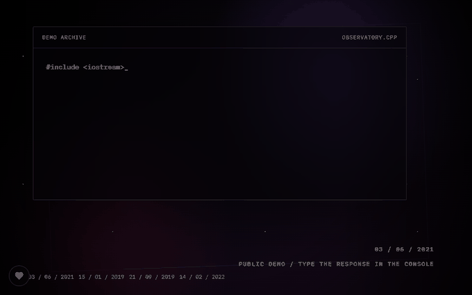
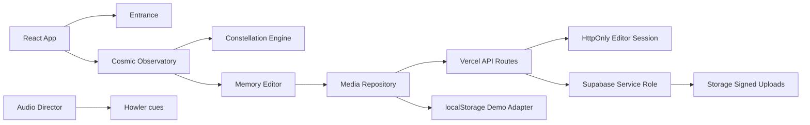

# Memory Observatory

A cinematic React memory archive that turns dated media entries into an interactive constellation.

[Live demo](https://jupi33.github.io/memory-observatory/) · [Architecture](docs/frontend-architecture.md) · [Security](SECURITY.md)




## What It Does

Memory Observatory is an interactive, full-screen archive for personal media collections. Instead of showing a conventional grid of photos, it maps memories into a living constellation where dates, categories, emotional tone, and manual links determine the position and relationships between stars.

The public repository ships with sanitized sample media and neutral demo records. A private deployment can connect to Supabase through the included Vercel API layer so uploaded memories, descriptions, responses, and media files persist across devices without storing private content in Git.

This repository is the sanitized public release of a project first developed privately. It keeps the implementation and architecture visible while replacing private content with neutral sample assets.

The experience is designed for mobile-first sharing by QR or direct link, while still supporting desktop navigation, keyboard zoom, editor flows, and a richer cinematic presentation.

Designed as a frontend-intensive portfolio project focused on cinematic UI, deterministic layout, and production-style quality gates.

## Tech Stack

- React 19, Vite, TypeScript
- React Three Fiber, Three.js, Drei
- Zustand for client state
- GSAP and Motion for cinematic transitions
- Howler.js for audio playback and fades
- Supabase database and storage behind server-side Vercel API routes
- HttpOnly editor sessions for protected writes
- Vercel deployment with API routes and scheduled keepalive

## Key Features

- Ritual-style entrance sequence before the main experience
- Full-screen constellation interface with deterministic layout and anti-overlap spacing
- Atlas, trajectory, and letter views backed by the same memory data model
- Inline editor for creating, editing, linking, responding to, and deleting memories
- Public read model with protected editor writes through Vercel serverless functions
- Supabase-backed production persistence with localStorage fallback for the static demo
- Mobile safeguards for reduced rendering cost, no horizontal overflow, and touch navigation
- Public-safe seeded data and placeholder media for recruiter review

## Engineering Highlights

- Deterministic constellation engine: memory position is derived from date precision, era, category, mood, and stable hashing, then relaxed with a deterministic anti-overlap pass.
- WebGL and DOM separation: `AtlasView` owns the React Three Fiber scene, while `CosmicObservatory` coordinates state, overlays, editor entry points, and audio cues.
- Persistence boundary: `mediaRepository` selects either the static localStorage adapter or a Vercel API adapter; the browser never receives the Supabase service role key.
- Secure editor flow: production writes require a short-lived signed HttpOnly cookie, while public reads remain open for QR sharing.
- Public/private data split: the repository ships sanitized media and demo records; production data lives outside Git in Supabase or another configured backend.
- Quality gates: formatting, linting, unit tests, desktop/mobile Playwright smoke tests, keyboard accessibility flows, Lighthouse budgets, bundle analysis, TypeScript build, and GitHub Pages deployment run in CI.

## Project Notes

- [Changelog](CHANGELOG.md)
- [Roadmap](ROADMAP.md)
- [Security notes](SECURITY.md)
- [Frontend architecture](docs/frontend-architecture.md)
- [Backend architecture](docs/backend-architecture.md)
- [Performance budget](docs/performance-budget.md)

## Architecture



The app is organized around a small set of runtime systems:

- `src/entrance/` controls the console-style access flow and intro montage.
- `src/cosmic/` renders the WebGL observatory and computes deterministic star placement.
- `src/memories/` contains the editor and linking workflow.
- `src/services/` selects the demo localStorage adapter or the production API adapter.
- `api/` contains Vercel functions for editor sessions, public memory reads, protected writes, signed media uploads, responses, audit events, and keepalive.

## Technical Trade-Offs

The observatory uses WebGL for the constellation because stars, camera movement, glow, and future 3D navigation benefit from a retained scene graph. The text-heavy surfaces remain DOM-based because forms, modals, keyboard controls, and screen-reader semantics are easier to maintain outside a canvas.

The layout engine is deterministic instead of physics-driven. That makes the public demo stable for reloads, tests, screenshots, and code review, while still allowing an anti-overlap pass to keep dense clusters readable.

Persistence is intentionally abstracted behind a media repository. The static GitHub Pages demo falls back to localStorage and sanitized sample media with no backend credentials. A production Vercel deployment uses `/api` routes, signed editor sessions, Supabase RLS, service-role writes on the server, and signed upload URLs for media.

Private media and real project notes are excluded from the public repository. Production secrets are expected to live in environment variables rather than Git.

## Getting Started

```bash
git clone https://github.com/Jupi33/memory-observatory.git
cd memory-observatory
npm install
npm run dev
```

Open `http://127.0.0.1:5173/`.

Useful checks:

```bash
npm run ci
npm run lint
npm run format:check
npm run test:unit
npm run test:e2e
npm run test:e2e:mobile
npm run test:e2e:keyboard
npm run test:a11y
npm run test:coverage
npm run analyze
npm run lighthouse
npm run build
```

## Environment Variables

Copy `.env.example` to `.env.local` for local experiments. Leave `VITE_API_BASE_URL` empty for the static demo/localStorage mode. Use `/api` for a same-origin Vercel deployment:

```bash
VITE_API_BASE_URL=/api
SUPABASE_URL=
SUPABASE_SERVICE_ROLE_KEY=
SUPABASE_MEDIA_BUCKET=memory-media
EDITOR_SECRET_HASH=
EDITOR_SESSION_SECRET=
CRON_SECRET=
```

`SUPABASE_SERVICE_ROLE_KEY`, `EDITOR_SECRET_HASH`, `EDITOR_SESSION_SECRET`, and `CRON_SECRET` are server-only values for Vercel. The repository intentionally does not include real secrets, production media, or private notes.

## Live Demo

[https://jupi33.github.io/memory-observatory/](https://jupi33.github.io/memory-observatory/)

The public demo uses sample data and sanitized placeholder media. Private deployments should load real memories from Supabase or another backend configured outside the repo.
