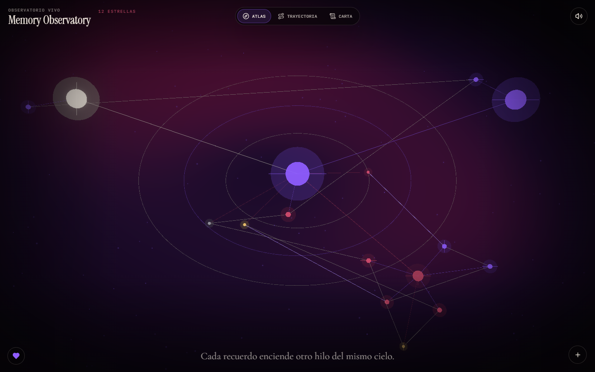
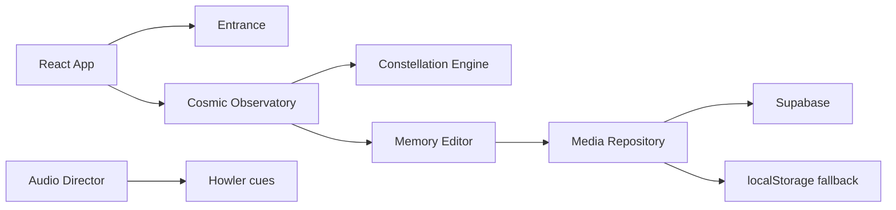

# Memory Observatory

A cinematic React memory archive that turns dated media entries into an interactive constellation.



## What It Does

Memory Observatory is an interactive, full-screen archive for personal media collections. Instead of showing a conventional grid of photos, it maps memories into a living constellation where dates, categories, emotional tone, and manual links determine the position and relationships between stars.

The public repository ships with sanitized sample media and neutral demo records. Production deployments can connect to Supabase so uploaded memories, descriptions, responses, and media files persist across devices without storing private content in Git.

This repository is a public demo snapshot prepared from a private/local project. It preserves the implementation and architecture while replacing private content with neutral sample assets.

The experience is designed for mobile-first sharing by QR or direct link, while still supporting desktop navigation, keyboard zoom, editor flows, and a richer cinematic presentation.

## Tech Stack

- React 19, Vite, TypeScript
- React Three Fiber, Three.js, Drei, react-postprocessing
- Zustand for client state
- GSAP and Motion for cinematic transitions
- Howler.js for audio playback and fades
- Supabase client, database, and storage integration
- Vercel deployment with a keepalive API route

## Key Features

- Ritual-style entrance sequence before the main experience
- Full-screen constellation interface with deterministic layout and anti-overlap spacing
- Atlas, trajectory, and letter views backed by the same memory data model
- Inline editor for creating, editing, linking, responding to, and deleting memories
- Supabase-backed persistence with localStorage fallback for development
- Mobile safeguards for reduced rendering cost, no horizontal overflow, and touch navigation
- Public-safe seeded data and placeholder media for recruiter review

## Engineering Highlights

- Deterministic constellation engine: memory position is derived from date precision, era, category, mood, and stable hashing, then relaxed with a deterministic anti-overlap pass.
- WebGL and DOM separation: `AtlasView` owns the React Three Fiber scene, while `CosmicObservatory` coordinates state, overlays, editor entry points, and audio cues.
- Persistence boundary: `mediaRepository` exposes one client API over Supabase and localStorage, so the static GitHub Pages demo works without backend credentials.
- Public/private data split: the repository ships sanitized media and demo records; production data lives outside Git in Supabase or another configured backend.
- Quality gates: formatting, linting, unit tests, TypeScript build, and GitHub Pages deployment run in CI.

## Project History

- [Changelog](CHANGELOG.md)
- [Roadmap](ROADMAP.md)
- [Security notes](SECURITY.md)

## Architecture



The app is organized around a small set of runtime systems:

- `src/entrance/` controls the console-style access flow and intro montage.
- `src/cosmic/` renders the WebGL observatory and computes deterministic star placement.
- `src/memories/` contains the editor and linking workflow.
- `src/services/` abstracts Supabase persistence, media uploads, and local fallback behavior.
- `api/keepalive.ts` is a Vercel function used to keep the Supabase project active.

## Getting Started

```bash
git clone https://github.com/Jupi33/memory-observatory.git
cd memory-observatory
npm install
npm run dev
```

Open `http://127.0.0.1:5173/`.

Useful checks:

```bash
npm run ci
npm run lint
npm run format:check
npm run test:unit
npm run test:e2e
npm run test:coverage
npm run build
```

## Environment Variables

Copy `.env.example` to `.env.local` and fill the values when using Supabase:

```bash
VITE_SUPABASE_URL=
VITE_SUPABASE_ANON_KEY=
VITE_SUPABASE_MEDIA_BUCKET=memory-media
```

For Vercel keepalive, configure `CRON_SECRET` in the Vercel project environment. The repository intentionally does not include real secrets, production media, or private notes.

## Live Demo

[https://jupi33.github.io/memory-observatory/](https://jupi33.github.io/memory-observatory/)

The public demo uses sample data and sanitized placeholder media. Production deployments should load private memories from Supabase or another backend configured outside the repo.
