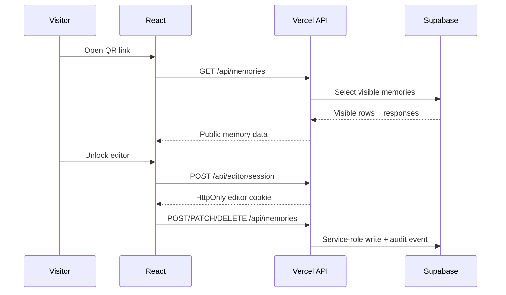

# Backend Architecture

Memory Observatory has two runtime modes:

- **Static public demo:** GitHub Pages serves sanitized assets and the app writes only to `localStorage`.
- **Production gift deployment:** Vercel serves the same React app plus API routes that read and write Supabase safely.

## Request Flow

## API Surface

- `POST /api/editor/session`: validates the private editor key hash server-side and sets an HttpOnly signed cookie.
- `GET /api/editor/session`: reports whether the current browser has a valid editor session.
- `DELETE /api/editor/session`: expires the editor cookie.
- `GET /api/memories`: public read of visible memories.
- `POST /api/memories`: protected create/upsert path.
- `PATCH /api/memories`: protected update path.
- `DELETE /api/memories`: protected delete path.
- `POST /api/memories/:id/responses`: protected response creation.
- `POST /api/media/upload-url`: protected signed upload URL creation for Supabase Storage.
- `GET /api/keepalive`: cron-protected Supabase heartbeat.

## Security Boundaries

The browser never receives the Supabase service role key. Public builds only know `VITE_API_BASE_URL`, and production writes require a valid editor cookie. The cookie is signed with `EDITOR_SESSION_SECRET`, marked `HttpOnly`, and uses `SameSite=Lax`.

Supabase RLS remains enabled. Anonymous users can read only visible rows. The Vercel API uses the service role key server-side for controlled writes, and each write attempts to record an audit event.

## Media Uploads

The app asks the API for a signed Supabase Storage upload URL, then uploads the selected file directly to Storage. This avoids pushing large media through Vercel functions and keeps broad storage write permissions out of the browser.

## Demo Fallback

When `VITE_API_BASE_URL` is empty, `mediaRepository` chooses the local adapter. That keeps the public GitHub Pages demo fully usable without backend secrets. When `VITE_API_BASE_URL=/api`, the API adapter is used and write errors such as `401` are surfaced instead of silently pretending production writes succeeded.
